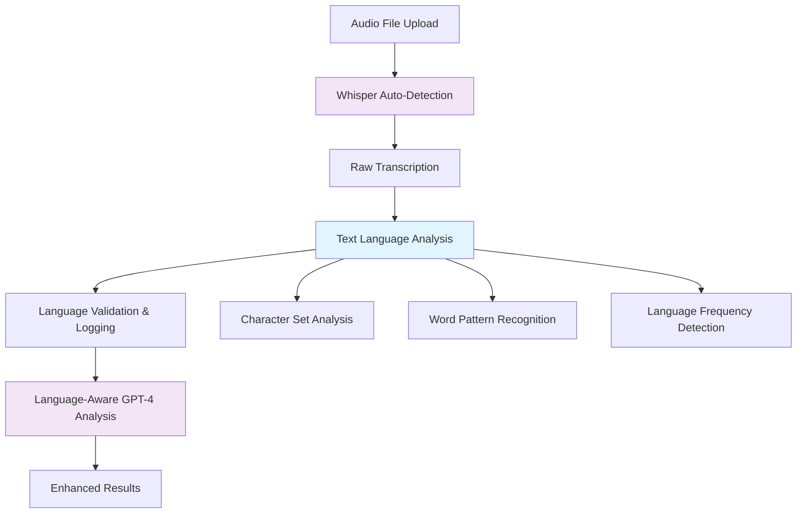

# Enhanced Call Analysis System

## Overview

The enhanced call analysis system has been implemented with the following key features:

1. **Automatic Language Detection** - Dynamic language detection without hardcoded preferences
2. **Enhanced Transcription** - Formatted with Speaker 1/Speaker 2 labels
3. **Structured Property Data Extraction** - Automatically extracts property details
4. **Advanced UI** - Tabbed interface with property details view

## Features Implemented

### 1. Dynamic Language Auto-Detection
- **Step 1: Transcription (OpenAI Whisper)**
  - Converts speech to raw text with fully automatic language detection
  - No hardcoded language preferences - Whisper detects the spoken language automatically
  - Supports multiple audio formats (MP3, WAV, M4A)
  - Post-transcription language validation using text analysis

- **Language Detection Flow**:
  1. Whisper automatically detects and transcribes the audio in the detected language
  2. Text-based language detection validates and logs the detected language
  3. System adapts analysis approach based on detected language (Arabic, Hebrew, English, etc.)
  4. Language-specific cleanup and correction applied

### 2. Enhanced Transcription & Analysis (OpenAI GPT-4)
- **Speaker Identification**: Formats transcript with "Speaker 1:" and "Speaker 2:" labels
- **Language-Aware Cleanup**: Dynamically handles different language combinations
  - Arabic conversations: Cleans Hebrew/Arabic mixing
  - Hebrew conversations: Handles Hebrew/Arabic mixing common in Israeli real estate
  - English conversations: Maintains professional real estate terminology
  - Mixed languages: Automatically detects and processes accordingly
- **Recognition Correction**: Fixes language-specific speech recognition errors
- **Punctuation & Structure**: Adds proper punctuation and sentence structure

### 3. Structured Data Extraction
The system automatically extracts the following property information:

#### Basic Info
- **Intent**: `buyer`, `seller`, or `unknown`
- **Location**: City or neighborhood name
- **Property Type**: apartment, house, commercial, land, other

#### Property Details
- **Rooms**: Number of rooms
- **Area**: Square meters
- **Price**: Price in ILS
- **Condition**: new, good, needs renovation, poor
- **Floor**: Floor number
- **Parking**: Boolean (Yes/No)
- **Balcony**: Boolean (Yes/No)
- **Property Notes**: Free text for additional details

#### Analysis
- **Summary**: Brief call summary
- **Follow-ups**: Recommended actions
- **Positives**: Positive aspects identified
- **Issues**: Areas for improvement

### 4. Updated Database Schema

```javascript
const CallSchema = new mongoose.Schema({
  userId: { type: mongoose.Schema.Types.ObjectId, ref: 'User', required: true },
  clientName: { type: String, required: true },
  phoneNumber: { type: String, required: true },
  date: { type: Date, default: Date.now },

  transcription: { type: String, required: true }, // formatted with speaker tags
  summary: { type: String, required: true },
  followUps: [String],
  positives: [String],
  issues: [String],

  intent: { type: String, enum: ['buyer', 'seller', 'unknown'], default: 'unknown' },
  location: { type: String },
  propertyType: { type: String },
  rooms: { type: Number },
  area: { type: Number },
  price: { type: Number },
  condition: { type: String },
  floor: { type: Number },
  parking: { type: Boolean },
  balcony: { type: Boolean },
  propertyNotes: { type: String },

  audioFileName: String,
  audioDuration: String
}, { timestamps: true });
```

### 5. Enhanced Frontend

#### Call Analysis Page (`/dashboard/call-analysis`)
- **Modern Upload Interface**: Drag & drop audio file upload
- **Real-time Processing**: Shows processing status with estimated time
- **Language Detection Indicator**: Shows detected language in processing
- **Tabbed Results View**: 
  - Transcription (with speaker labels)
  - Summary (with positive aspects)
  - Property Details (structured property information)
  - Follow-ups (recommended actions)
  - Issues (areas for improvement)

#### Call History
- **Enhanced List View**: Shows intent badges, location tags, and property info
- **Quick Property Preview**: Room count, property type, and price display
- **Improved Navigation**: Links to detailed call analysis

#### Call Detail Page (`/dashboard/call-analysis/[id]`)
- **Complete Property Information**: Full structured property data display
- **Enhanced Header**: Shows intent, location, and key details
- **Tabbed Content**: Same structure as main analysis page
- **Property Cards**: Visual cards for each property attribute

## Technical Implementation

### Files Modified

1. **Backend**:
   - `app/models/Call.js` - Updated schema with property fields
   - `app/utils/aiAnalysis.js` - Enhanced with dynamic language detection and GPT-4 analysis
   - `app/utils/languageDetection.js` - Text-based language detection utility
   - `app/api/calls/route.js` - Updated to handle new fields
   - `app/api/call-analysis/route.js` - Enhanced response with property data

2. **Frontend**:
   - `app/dashboard/call-analysis/page.js` - Complete UI overhaul with property details
   - `app/dashboard/call-analysis/[id]/page.js` - Enhanced detail view

### OpenAI Integration

#### Whisper Configuration (Dynamic Language Detection)
```javascript
const transcription = await openai.audio.transcriptions.create({
  file: fs.createReadStream(tempFilePath),
  model: "whisper-1",
  // No language parameter - automatic detection
  response_format: 'text'
});

// Post-transcription language validation
const detectedLanguage = detectLanguage(transcription);
logger.info(`Language detected: ${detectedLanguage}`);
```

#### GPT-4 Analysis Prompt (Language-Aware)
The system uses language-aware prompts that adapt based on detected language:
- **Arabic**: Handles Hebrew/Arabic mixing common in Middle Eastern real estate
- **Hebrew**: Processes Hebrew/Arabic mixing typical in Israeli real estate
- **English**: Maintains professional real estate terminology
- **Mixed/Unknown**: Automatically detects and processes accordingly

## Language Detection Process



## Usage Instructions

1. **Upload Audio File**:
   - Navigate to `/dashboard/call-analysis`
   - Enter client name and phone number
   - Upload audio file (MP3, WAV, M4A) in any supported language
   - Click "Analyze Call"

2. **Language Detection Process**:
   - System automatically detects the spoken language
   - No manual language selection required
   - Processing adapts to detected language automatically

3. **Review Results**:
   - **Transcription Tab**: View enhanced transcript with speaker labels
   - **Summary Tab**: Read call summary and positive aspects
   - **Property Details Tab**: View extracted property information
   - **Follow-ups Tab**: See recommended actions
   - **Issues Tab**: Review areas for improvement

4. **Access History**:
   - View recent calls in the history section
   - Click on any call to see full details
   - Property information is displayed as badges for quick reference

## Environment Variables Required

```env
OPENAI_API_KEY=your_openai_api_key
NEXT_PUBLIC_CLOUDINARY_CLOUD_NAME=your_cloudinary_cloud_name
CLOUDINARY_API_KEY=your_cloudinary_api_key
CLOUDINARY_API_SECRET=your_cloudinary_api_secret
```

## Benefits

1. **True Language Flexibility**: No hardcoded language assumptions - works with any language
2. **Accurate Detection**: Whisper's automatic detection is more accurate than hardcoded settings
3. **Context-Aware Processing**: Analysis adapts to the detected language for better results
4. **Multi-Language Support**: Handles various language combinations automatically
5. **Professional Interface**: Clean, modern UI with intuitive navigation
6. **Structured Data**: Property details automatically extracted regardless of language
7. **Actionable Insights**: Provides specific follow-up recommendations in appropriate language

## Future Enhancements

Potential improvements could include:
- Real-time language switching detection within conversations
- Confidence scoring for language detection
- Custom language model training for specific dialects
- Integration with specialized real estate terminology databases
- Voice sentiment analysis across different languages
- Multi-language support expansion to additional markets 